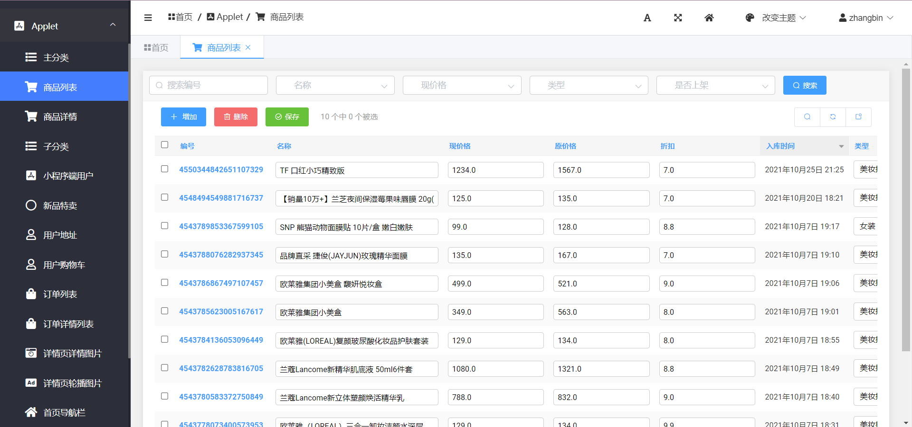

## KnowGoods

### 1、设计理念

```python
	在当下社会，女孩子无疑是流量密码，想成为走在大街就能够引起众多男孩子地回头，不管是浓妆还是淡妆，自然是少不了化妆品。所以本人就设计了这么一款“专注于女孩子的小程序”，其与普通商城类项目差别并不是多大。只是更多了专注于女孩子。
```

### 2、项目截图
**首页图片展示**


**商品详情展示**


**登录界面展示**


**登录成功展示**


**商品分类展示**


**商品分类列表展示**


**购物车商品展示**


**商品结算展示**


**订单状态展示**


**后台首页展示**


**后台侧边栏展示**



